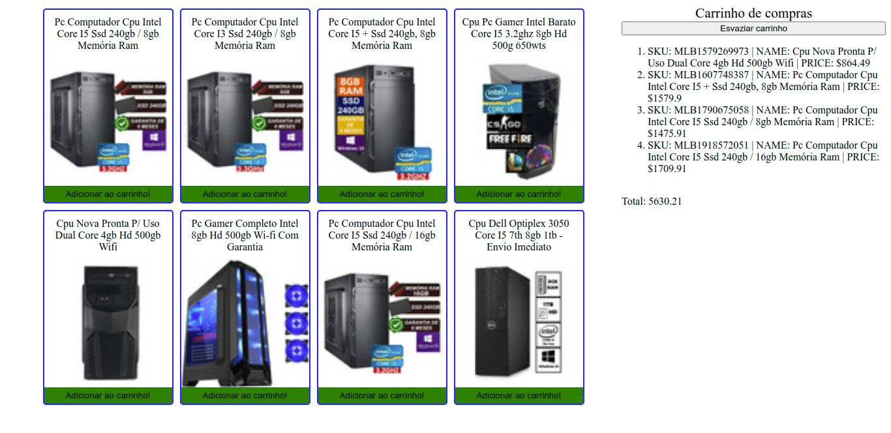

<h1 align="center">
  
</h1>

<h3 align="center">
  Curso realizado na Trybe - Edu Souza o/
</h3>

<blockquote align="center">“Não leve a vida tão a sério. Você nunca sairá vivo dela - Elbert Hubbard”</blockquote>

<h4 align="center">
  Repositório - Carrinho de compras
</h4>

 

  &nbsp;
  &nbsp;
  

  <a href="#rocket-Sobre-o-projeto">Sobre o projeto</a>&nbsp; &nbsp; |&nbsp; &nbsp;
  <a href="#postbox-Entrega"">Entrega</a>&nbsp; &nbsp; |&nbsp; &nbsp;
  <a href="#unlock-Licença">Licença</a>

## :rocket: Sobre o projeto

#### Carrinho de compras

Você vai implementar um carrinho de compras em uma página web.
Imagine que você trabalha em uma empresa que vende produtos online. Para melhorar a experiência da pessoa que acessa esse e-commerce, você será responsável por desenvolver um carrinho de compras. Todo e-commerce, como, por exemplo, Amazon, Americanas e Submarino, possui um carrinho de compras para auxiliar as pessoas consumidoras a salvar os itens que desejam comprar.

#### Screenshots:

   &nbsp;

## :postbox: Entrega

#### :clipboard: Requisitos

- 
<a href="#1"> :pushpin: 1.</a> Listagem de produtos.

- 
<a href="#2"> :pushpin: 2.</a> Adicione o produto ao carrinho de compras.

- 
<a href="#3"> :pushpin: 3.</a> Remova o item do carrinho de compras ao clicar nele.

- 
<a href="#4"> :pushpin: 4.</a> Carregue o carrinho de compras através do **LocalStorage** ao iniciar a página.

- 
<a href="#5"> :pushpin: 5.</a> Some o valor total dos itens do carrinho de compras de forma assíncrona.

- 
<a href="#6"> :pushpin: 6.</a> Botão para limpar carrinho de compras.

- 
<a href="#7"> :pushpin: 7.</a> Adicionar um texto de "loading" durante uma requisição à API.

### Concluído :rocket:

Acesse o deploy do projeto [aqui](https://edusouza-programmer.github.io/Trybe_Projeto_6-6_Edu_Souza/).

#
## :unlock: Licença

Este projeto está licenciado sob a Licença MIT - consulte [LICENSE](https://opensource.org/licenses/MIT) para maiores detalhes.
